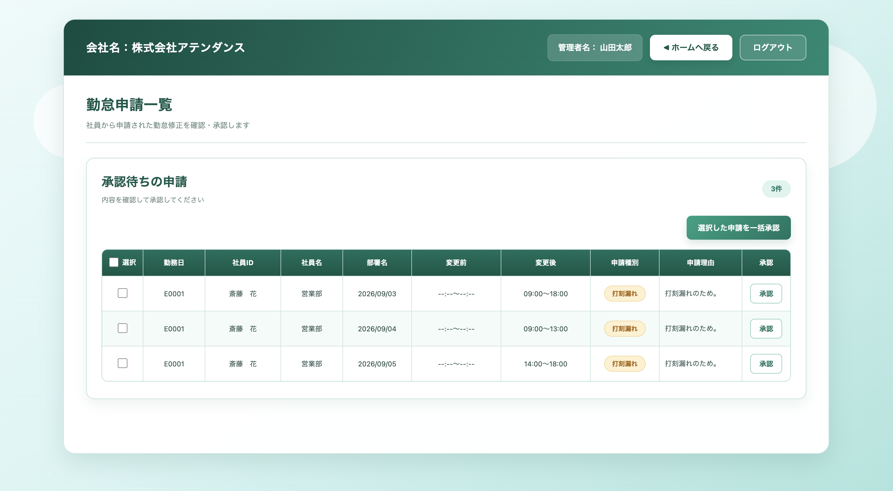

## サービスのURL
http://54.90.243.74:8080/login

## サービスへの想い
〇〇

## アプリケーションのイメージ

## 機能一覧
| ログイン画面 | 従業員ホーム画面 | 
| :--------------------------: | :-------------------------: | 
|  | 
| ログインIDとパスワードでの認証機能を実装しました。| 出勤・退勤を打刻し、当日の打刻時刻を確認できます。勤怠一覧・勤怠修正・有給申請の各画面へ移動できます。 |

| 勤怠一覧画面 | 勤怠申請画面 | 
| :--------------------------: | :-------------------------: | 
|  |  
| 勤務予定の登録・日ごとの打刻実績・申請状況の確認ができます。 | 打刻漏れや勤務時間の修正を、理由を添えて申請できます。 |

| 有給申請画面 | 管理者ホーム画面 | 
| :--------------------------: | :-------------------------: | 
|  |  
| 取得日と有給の種類を選び、理由を添えて申請できます。 | 社員管理や勤怠確認、申請の承認画面へ移動できます。 |

| 社員管理画面 | 新規登録画面 | 
| :--------------------------: | :-------------------------: | 
|  |  
| 社員の検索・登録・編集ができます。 | 社員情報を登録し、社員IDと初期パスワードを発行します。 |

| 勤怠実績確認画面 | 勤怠承認画面 |
| :--------------------------: | :-------------------------: | 
|  | 
| 月や部署、社員で絞り込み、勤務状況を確認できます。 | 申請内容と変更前後の時刻を確認し、承認できます。 |
