## サービスのURL
https://www.rina-attendance.mydns.jp:8443/login

## サービスへの想い
初めてのアプリ開発として、これまでの業務経験で身近だった勤怠管理をテーマに選びました。 
業務の中で発生する勤怠管理の手間や確認作業を解決するため、 
従業員が簡単に打刻・申請でき、管理者が効率よく確認できるサービスを開発しました。 
利用者目線を大切にし、日々の業務を支えるシステムを目指しています。

## アプリケーションのイメージ
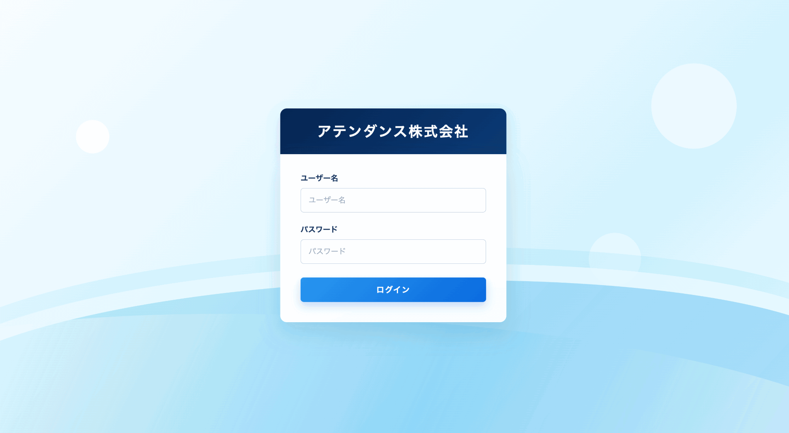

## 機能一覧
| ログイン画面 | 従業員ホーム画面 | 
| :--------------------------: | :-------------------------: | 
| 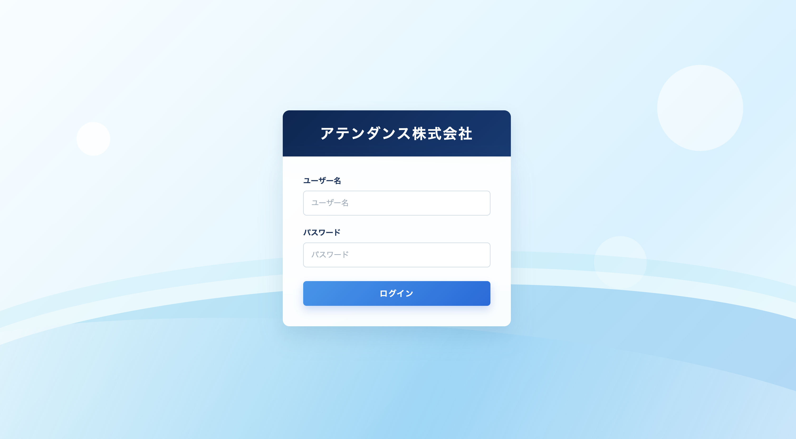 | 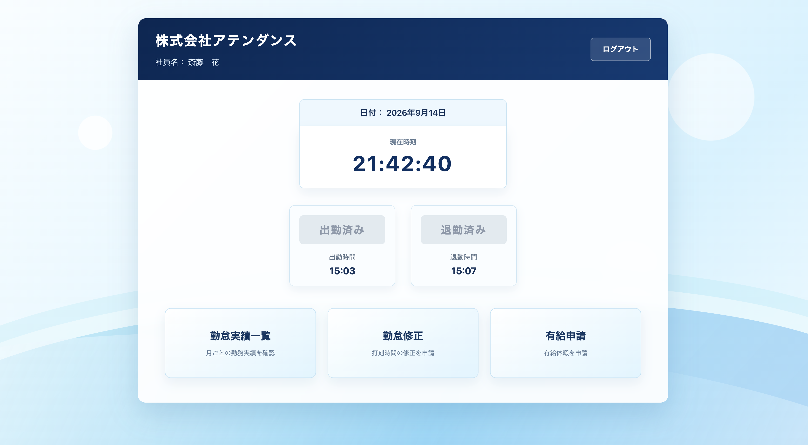
| ログインIDとパスワードでの認証機能を実装しました。| 出勤・退勤を打刻し、当日の打刻時刻を確認できます。勤怠一覧・勤怠修正・有給申請の各画面へ移動できます。 |

| 勤怠一覧画面 | 勤怠申請画面 | 
| :--------------------------: | :-------------------------: | 
| 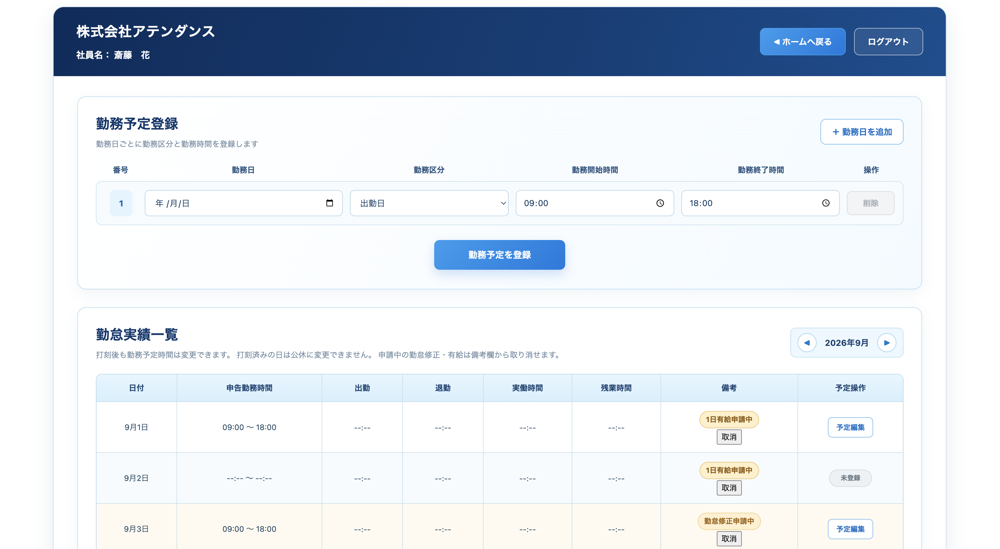 | 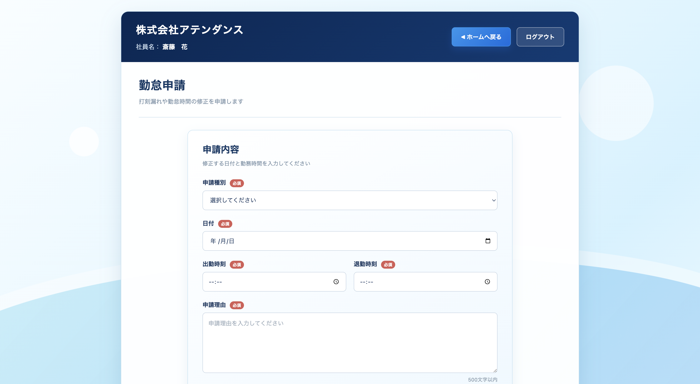 
| 勤務予定の登録・日ごとの打刻実績・申請状況の確認ができます。 | 打刻漏れや勤務時間の修正を、理由を添えて申請できます。 |

| 有給申請画面 | 管理者ホーム画面 | 
| :--------------------------: | :-------------------------: | 
| 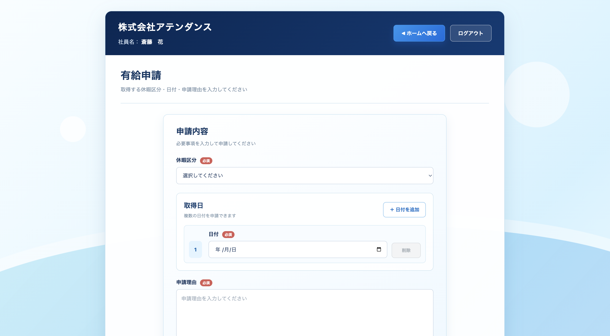 | 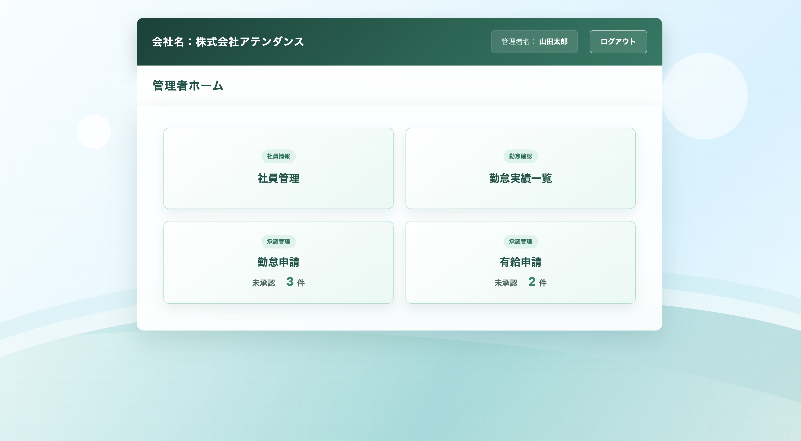 
| 取得日と有給の種類を選び、理由を添えて申請できます。 | 社員管理や勤怠確認、申請の承認画面へ移動できます。 |

| 社員管理画面 | 新規登録画面 | 
| :--------------------------: | :-------------------------: | 
| 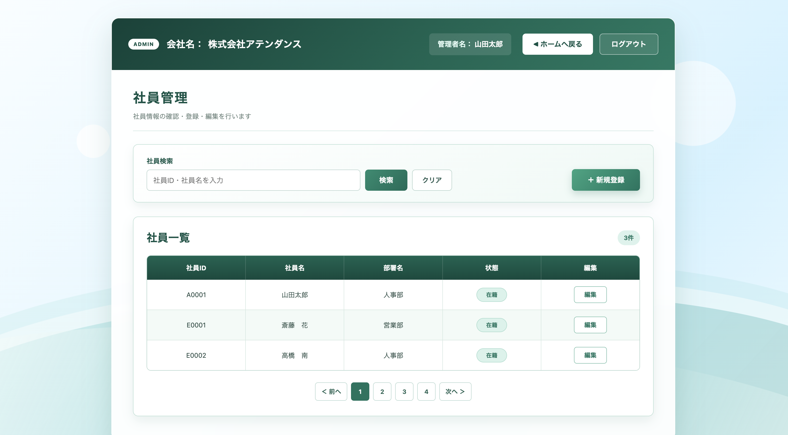 | 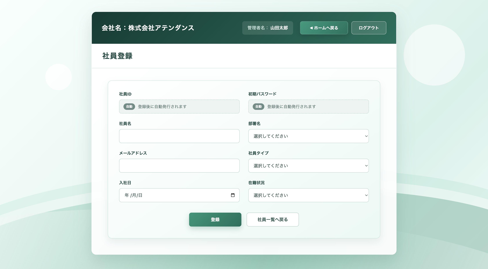 
| 社員の検索・登録・編集ができます。 | 社員情報を登録し、社員IDと初期パスワードを発行します。 |

| 勤怠実績確認画面 | 勤怠承認画面 |
| :--------------------------: | :-------------------------: | 
| 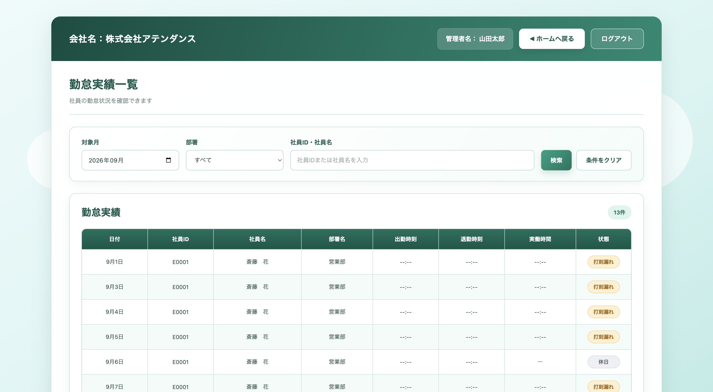 | 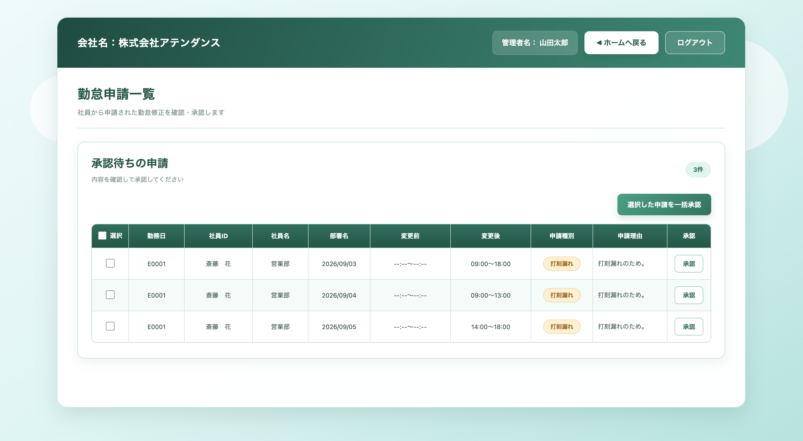
| 月や部署、社員で絞り込み、勤務状況を確認できます。 | 申請内容と変更前後の時刻を確認し、承認できます。 |

## 使用技術
| 分類 | 使用技術 |
| :--- | :--- |
| フロントエンド | HTML , CSS , JavaScript、Thymeleaf |
| バックエンド | Java 21 , Spring Boot , Spring Security , MyBatis |
| データベース | PostgreSQL |
| インフラ | AWS EC2 |
| 開発環境・バージョン管理 | Eclipse , Gradle , Git , GitHub |

## システム構成図
<table>
  <tr>
    <td>
      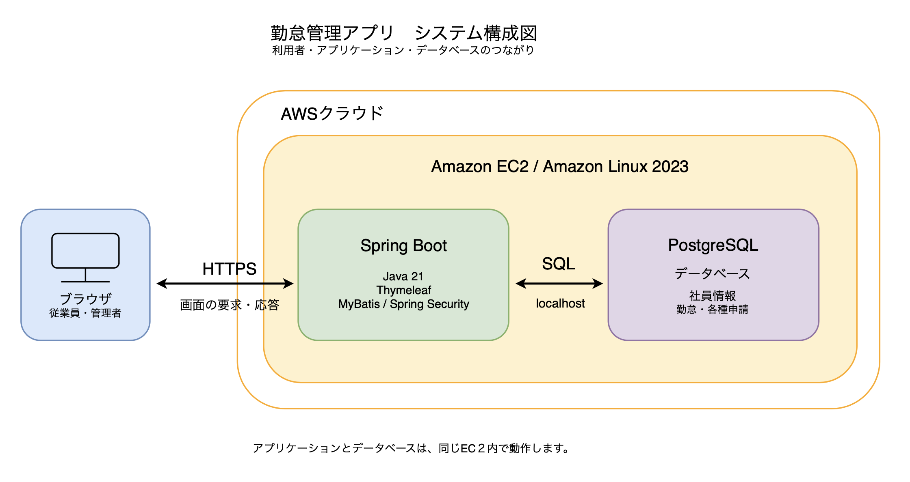
    </td>
  </tr>
</table>

## ER図
<table>
  <tr>
    <td>
      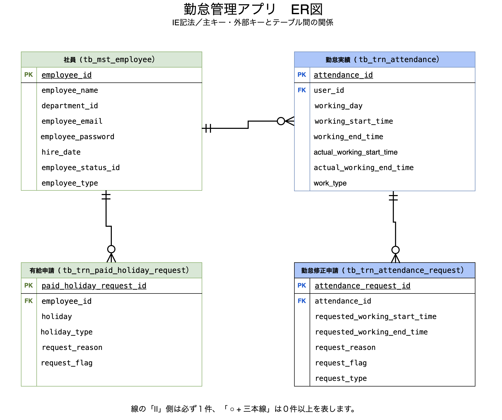
    </td>
  </tr>
</table>

## 今後の展望
本アプリでは、出退勤の打刻や勤怠修正、有給休暇の申請、管理者による承認など、勤怠管理の基本機能を実装しています。 
将来的には、以下の５つのフェーズに分けて段階的に機能の追加し、従業員と管理者の双方が使いやすいアプリを目指します。 
・フェーズ１：申請履歴の確認機能 
　過去の勤怠修正や有給休暇の申請内容と、承認や却下の結果を一覧で確認できる機能を追加する。 
 
・フェーズ２：有給休暇の残日数の表示機能 
　有給休暇の取得日数と残日数の確認ができる機能を追加する。 
 
・フェーズ３：承認済みの申請の取り消し機能 
　従業員が承認済み申請の取り消しを申請し、管理者の確認と承認を経て取り消せる機能を追加する。 
 
・フェーズ４：通知機能 
　申請が承認や却下された際に、アプリ内に通知を表示する機能を追加する。 

 ・フェーズ５：操作前の確認画面の改善 
 　パスワードの再設定など、重要な操作を行う際の確認画面をアプリ内に表示し、ご操作を防ぎながら、画像デザインを統一する。
